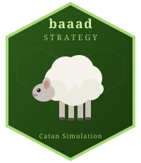

# baaad-strategy



A Monte Carlo simulation in R that proves, statistically, that the sheep strategy in Catan is **baaad**.

The sheep strategy — obsessively settling on high-wool hexes and racing to the 2:1 Wool port — sounds clever. This project runs thousands of simulated games to show it loses significantly more often than a balanced approach.

---

## Strategies

Three strategies compete in every simulation:

| Strategy | Description |
|---|---|
| `balanced` | Maximizes pip count and resource diversity; prioritizes ore + grain for city scaling; uses best available port |
| `sheep` | Scores placements by adjacent wool pips; routes roads to the 2:1 Wool port; dumps surplus wool into dev cards |
| `ore_grain` | Prioritizes ore and grain hexes; fast-tracks city upgrades |

---

## Hypothesis

The sheep strategy should lose because:

- Wool is needed for settlements and dev cards but **not cities**, which are the primary VP-scaling mechanism
- Wool hexes are the **most abundant** (4 of 19), so opponents produce plenty naturally — the 2:1 Wool port offers less edge than a 2:1 Ore or 2:1 Grain port
- Prioritizing wool placement sacrifices better ore/grain spots, starving the city-building engine
- A wool surplus with no matching ore/grain cannot efficiently convert to victory points

**Success criterion:** sheep strategy win rate is statistically significantly lower than balanced strategy (p < 0.05) across 1,000 simulated games.

---

## Architecture

Written in base R with `ggplot2` and `patchwork`. Seven modules:

```
R/
  board.R           # hex graph, board generation, intersection/edge topology, ports
  player.R          # player state, resources, dev cards, VP tracking
  strategy.R        # strategy interface + three implementations
  game.R            # single game loop (setup, turns, win detection)
  simulation.R      # Monte Carlo runner (serial and parallel)
  analysis.R        # results aggregation, statistical test, output plots
  visualize_board.R # board and game-state visualizations
```

### Key simplifications vs. full Catan rules

| Rule | Simplification |
|---|---|
| Player-to-player trading | Omitted; bank/port trading only |
| Longest Road | Tracked; 2 VP awarded at threshold |
| Largest Army | Tracked; 2 VP at 3+ knights |
| Dev card variety | All five types implemented (Knight, VP, Road Building, Year of Plenty, Monopoly) |
| Robber targeting | Always targets the leading player |

---

## Usage

### Run a simulation

```r
source("R/board.R")
source("R/player.R")
source("R/strategy.R")
source("R/game.R")
source("R/simulation.R")

strategies <- list(
  balanced  = balanced_strategy(),
  sheep     = sheep_strategy(),
  ore_grain = ore_grain_strategy()
)

sim <- run_simulation(n_games = 1000, strategies = strategies, seed = 42)
```

Parallel execution is supported via the `n_cores` argument:

```r
sim <- run_simulation(n_games = 1000, strategies = strategies,
                      seed = 42, n_cores = 4L)
```

Results are written to `results/simulation_results.csv` and `results/simulation_players.csv`.

### Analyse results

```r
source("R/analysis.R")

run_analysis(sim)
# Saves win_rates.png, vp_distribution.png, game_length.png to figures/
# Prints chi-squared test interpretation to console
```

You can also load a previous run from disk:

```r
run_analysis("results")
```

### Inspect a single game

`run_game()` returns the final board state and all player objects alongside the summary statistics, making it easy to inspect what happened:

```r
result <- run_game(strategies, seed = 41)

result$winner_id        # winning player ID
result$turns            # number of turns taken
result$players          # data.frame summary (one row per player)
result$player_objects   # full player state list
result$board            # final board state
```

### Visualize the board

`plot_board()` renders the hex grid with terrain, tokens, ports, and any placed pieces:

```r
source("R/visualize_board.R")

result <- run_game(strategies, seed = 41)

# Board only
plot_board(result$board)

# Board with player legend labels derived from strategy names
plot_board(result$board, players = result$player_objects)
```

### Full game-state view

`plot_game_state()` composes the board with per-player info panels showing VP breakdown, special cards, knights played, and resources in hand. Player 1 sits on the left, Player 2 across the top, Player 3 on the right, each panel colored to match their piece color.

```r
plot_game_state(result$board, result$player_objects)
```

Recommended save dimensions (4:3 keeps the board square):

```r
png("figures/game_state.png", width = 2400, height = 1800, res = 150)
print(plot_game_state(result$board, result$player_objects))
dev.off()
```

The `size` parameter scales all visual elements — board, pieces, text, and panels — proportionally:

```r
plot_game_state(result$board, result$player_objects, size = 2)
```
